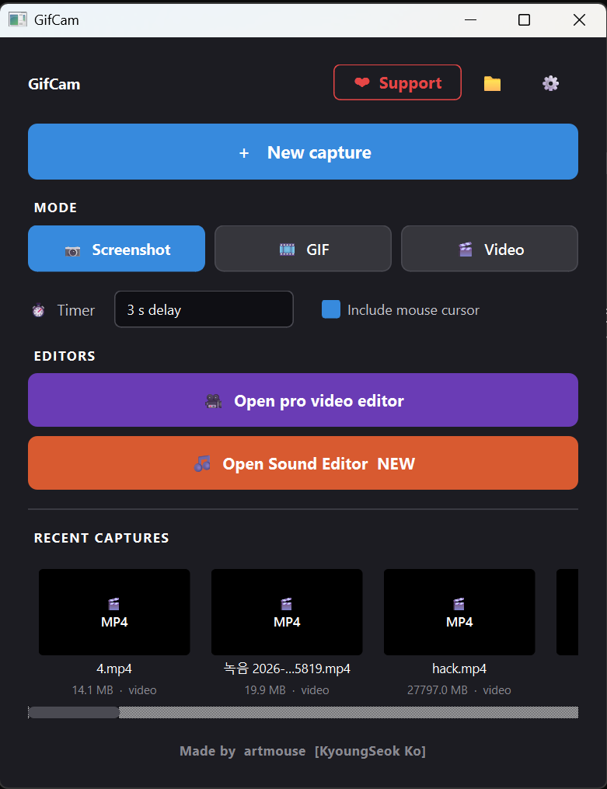
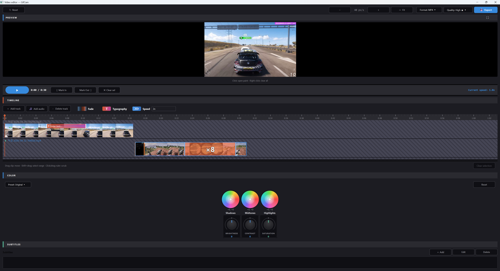
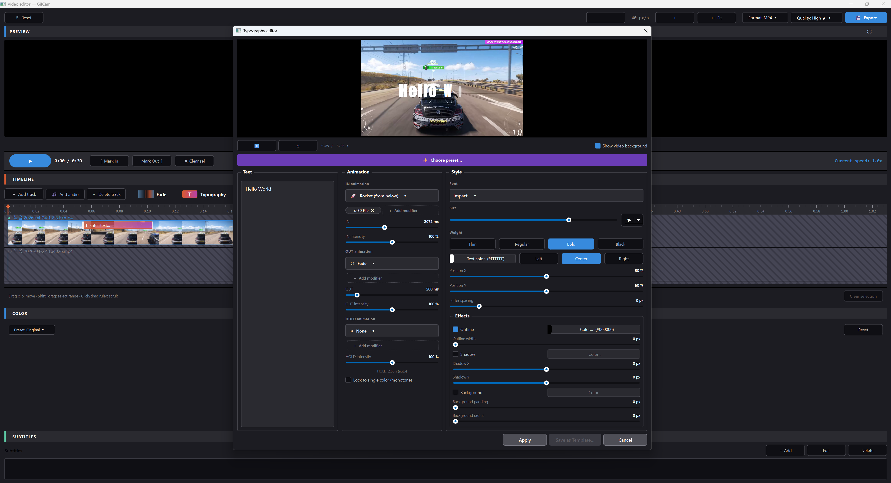
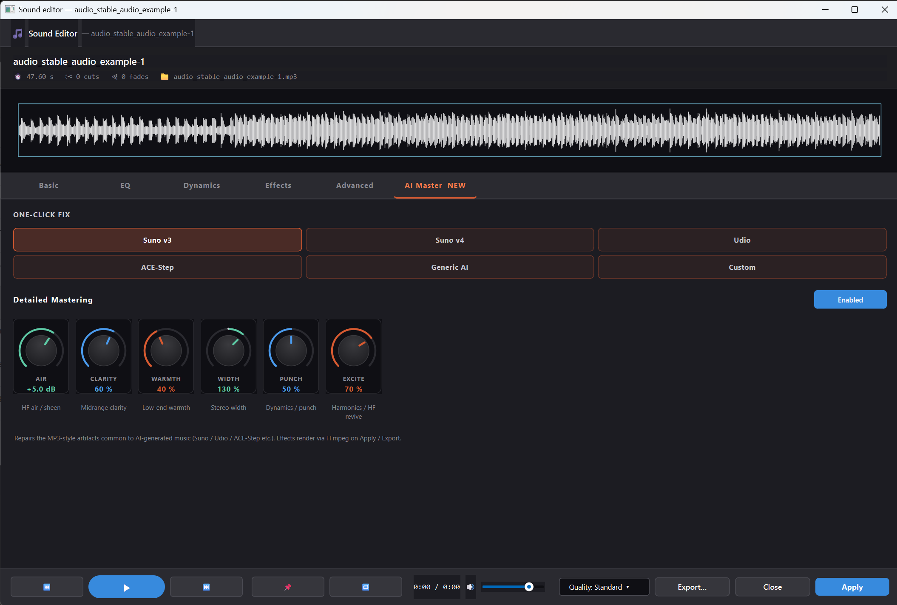
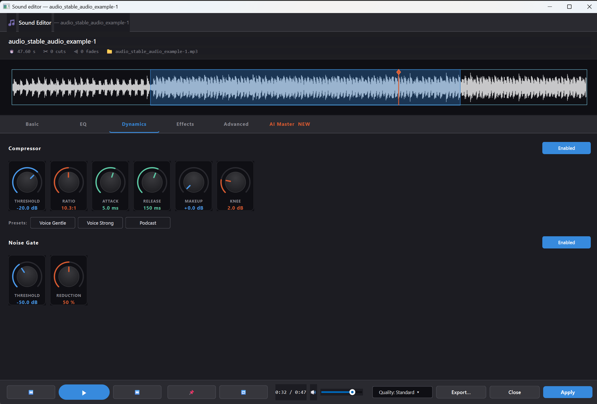
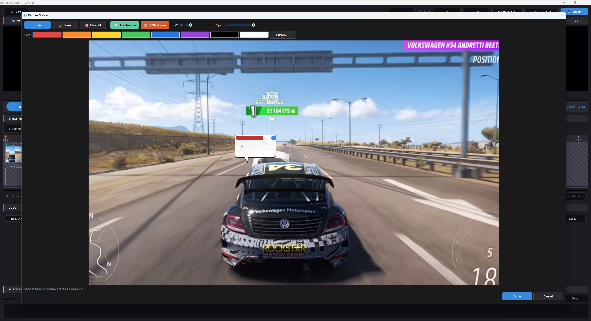
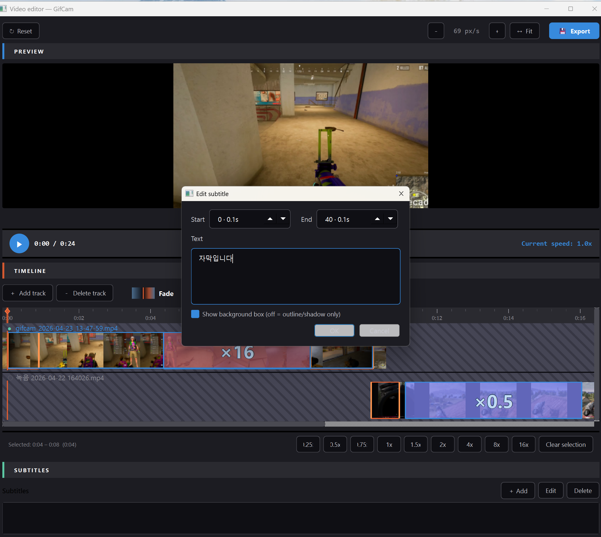

# GifCam

A Windows screen-capture studio — record a region as a screenshot, GIF,
or MP4, then jump into a full editor with **kinetic typography**,
**3-wheel color grading**, **paint-on-preview**, **subtitles**, and a
deep **sound editor** with AI mastering presets and dynamics.

**Made by** [artmouse (KyoungSeok Ko)](https://github.com/kuoungseok)

---



## What it does

GifCam started as a HoneyCam-style GIF / video screen-capture tool. It
has since grown into a single-window editing studio for short-form video
content — with the recorder feeding straight into a pro-grade timeline.

- **Three capture modes** — Screenshot, GIF, MP4
- **Pro video editor** — multi-track timeline, cuts, speed segments,
  fades, subtitles, paint, stickers, speech bubbles, kinetic typography,
  3-wheel color grading
- **Sound editor** — Basic / EQ / Dynamics / Effects / Advanced /
  AI Master tabs with knob-based controls, one-click mastering presets
  for Suno v3 / v4 / Udio / ACE-Step, and 6-knob detailed mastering
- **6-language UI** — Korean / English / 日本語 / 中文 / Français /
  Deutsch, auto-detected from the system locale, switchable live

## Pro video editor



- Multi-track timeline with per-track speed segments, cuts, and fades
- Drag a `Speed` card onto a track to time-warp a region; drag the
  `T` (Typography) card for animated text overlays
- **3-wheel color grading**: DaVinci-style Shadows / Midtones /
  Highlights chromaticity wheels with luma-aware tonal masks, plus
  bipolar Brightness / Contrast / Saturation knobs that match the
  sound editor's UI vocabulary
- **8 color presets** — Cinematic, Vintage, Cool, Warm, Faded, B&W,
  Punch, Mute. The "designed look" presets (Cinematic, Vintage, etc.)
  are Pro-only, so Free users still have the wheels and knobs to grade
  manually
- Export quality (Low / Standard / High / Best) and format
  (MP4 / WebM / MOV) dropdowns; High and Best presets, plus WebM and
  MOV containers, are Pro-tier

## Kinetic typography



- **80+ kinetic animations** organized by category (Basic, Kinetic,
  Folding, HOLD), plus a 1-of-a-kind utaite-style multi-layer Eve
  glitch with RGB split
- **Animation composition** — every slot (IN / HOLD / OUT) accepts a
  primary animation **plus a list of "modifier" extras** that stack on
  top: offsets add, rotations add, scales/opacity multiply.
  IN × HOLD × OUT × extras puts the practical combination count into
  the millions
- **HOLD-phase loops** for breathing, swaying, shimmering text — they
  cycle seamlessly at the animation's loop period
- **12 curated presets** for utaite / J-MV / K-pop / DEVILA aesthetics
- **Mono-color mode** strips per-glyph color overrides so a fancy preset
  keeps its motion but sticks to the user's chosen text color

## Sound editor — AI mastering + dynamics



- **AI Master tab** — one-click fixes for the MP3-style artifacts in
  AI-generated music (Suno v3 / v4, Udio, ACE-Step) plus a generic
  preset and a Custom slot
- **Detailed Mastering** with 6 dedicated knobs: Air, Clarity, Warmth,
  Width, Punch, Excite
- All effects render through FFmpeg on Apply / Export — no real-time
  DSP shenanigans, the preview matches the file you ship



- **Compressor** with Threshold / Ratio / Attack / Release / Makeup /
  Knee plus Voice Gentle / Voice Strong / Podcast presets
- **Noise Gate** with Threshold + Reduction
- Selection, markers, loop region, transport, and **per-format
  audio export** (MP3, WAV free; FLAC, ALAC, AAC, OGG Pro) at four
  quality presets (Low / Standard / High / Studio — sample rate and
  bit depth bumps; High and Studio are Pro)

## Paint on preview + subtitles



- Paint colored strokes directly on the preview frame; strokes burn
  into the exported MP4 / WebM / MOV
- Eraser, color picker, brush width



- Start / End time pickers, multi-line text, optional background box
  (off = outline + shadow only)
- Live preview overlay during playback

## Pro vs Free

The editor ships with a deliberate Pro / Free split — Free users see
the full editor and preview, but specific export and preset choices are
locked. The current build has `is_pro()` returning `True` so everything
works; flipping a single flag activates the gating below:

| Feature | Free | Pro |
|---|---|---|
| Export quality | Low, Standard | High, Best |
| Export format | MP4 (H.264) | + WebM (VP9), MOV |
| Audio formats | MP3, WAV | + FLAC, ALAC, AAC, OGG |
| Audio quality | 22 / 44.1 kHz, 16-bit | + 48 / 96 kHz, 24-bit |
| Color presets | Cool, Warm | + Cinematic, Vintage, Faded, B&W, Punch, Mute |
| Color sliders + wheels | All | All |
| Typography overlays in export | ❌ (preview only) | ✅ |
| Typography editor + 80+ animations | ✅ | ✅ |

## Install (Windows)

### Option 1 — Installer (recommended)

Download `GifCam-Setup-<version>.exe` from the
[Releases page](https://github.com/kuoungseok/gifcam/releases) and run
it. No administrator rights required; installs to
`%LOCALAPPDATA%\GifCam` and registers under **Settings → Apps →
Installed apps** for clean uninstall.

### Option 2 — Portable

Download `GifCam-<version>-portable.zip`, unzip anywhere, run
`GifCam.exe`. Delete the folder to "uninstall". Captures stay in
`~/Videos/GifCam`.

## System requirements

- Windows 10 1903 or newer (Windows Graphics Capture API)
- x64 architecture

## macOS port (experimental, unverified)

A macOS port lives in [`mac/`](mac/) and reuses the shared UI code via
a namespace-package overlay. Five Windows-only modules are replaced
with ScreenCaptureKit / AppKit / Quartz equivalents via PyObjC.

GitHub Actions automatically builds an ad-hoc-signed `.app` and
`.dmg` on every push to `main` — see the
[Actions tab](https://github.com/kuoungseok/gifcam/actions) for the
latest build artifacts. Tagging a commit `v*-mac*` (e.g. `v1.4.0-mac`)
publishes the .dmg as a GitHub Release.

**Important:** the macOS port has **not yet been verified on real
hardware**. It was authored from Windows against Apple's API docs and
will likely need iterative fixes on first launch. The Windows build is
unaffected.

To build locally on a Mac:

```bash
python3 -m venv .venv
.venv/bin/pip install -r mac/requirements-mac.txt
./mac/build.sh --dmg
```

See [`mac/README-mac.md`](mac/README-mac.md) for full instructions and
the right-click → Open Gatekeeper workaround.

## Development

### Setup (Windows)

```powershell
py -3.13 -m venv .venv
.venv\Scripts\Activate.ps1
pip install -r requirements.txt
python main.py
```

### Build

```powershell
.\build.ps1              # PyInstaller only  -> dist\GifCam\
.\build.ps1 -NSIS        # + NSIS installer  -> installer_output\
.\build.ps1 -Clean       # clean build artifacts first
```

The build script expects NSIS to be installed
(`winget install NSIS.NSIS`); it locates `makensis.exe` automatically
in `C:\Program Files (x86)\NSIS`.

### Optional external tools

Drop these in `bundled/` to improve GIF output — the app picks them up
automatically:

- **[gifski](https://gif.ski/)** (`bundled/gifski.exe`) —
  near-video-quality GIF encoder; preferred when present
- **[gifsicle](https://www.lcdf.org/gifsicle/)**
  (`bundled/gifsicle.exe`) — final lossy optimization pass

## Architecture

- `main.py` — entry point, wires i18n + controller + main window
- `app/main_window.py` — main UI (Win11 Snipping Tool–style)
- `app/controller.py` — coordinates region selection, recording, editor
- `app/region_selector.py` — per-monitor overlays for accurate
  selection on mixed-DPI multi-monitor setups
- `app/recorder.py` — WGC-backed frame recorder
- `app/gif_editor_window.py` — frame-by-frame GIF / Video editor
- `app/video_editor_window.py` — pro multi-track video editor
- `app/typography.py` + `app/typo_animations.py` +
  `app/typo_render.py` + `app/typo_presets.py` — kinetic typography
  data model, animation registry, offscreen MOV renderer, presets
- `app/color_grading.py` — 3-wheel + brightness / contrast /
  saturation grading, numpy preview + ffmpeg `eq + colorbalance`
- `app/audio_tracks.py` — audio clip data + per-clip exporter +
  AI-mastering rendering pipeline
- `app/exporter.py` — GIF (Pillow / gifski) and MP4 encoders
- `app/video_exporter.py` — pro-editor exporter (filter graph,
  H.264 / VP9 / qtrle, audio mix)
- `app/tier.py` — Pro / Free gating (single source of truth)
- `app/i18n.py` + `app/locales/{ko,en,ja,zh,fr,de}.py` — locale system

## License

MIT — see [LICENSE](LICENSE).

## Credits

Built with [PySide6](https://doc.qt.io/qtforpython/),
[Pillow](https://python-pillow.org/),
[imageio-ffmpeg](https://github.com/imageio/imageio-ffmpeg), and
[windows-capture](https://pypi.org/project/windows-capture/).
Installer packaged with [NSIS](https://nsis.sourceforge.io/).
